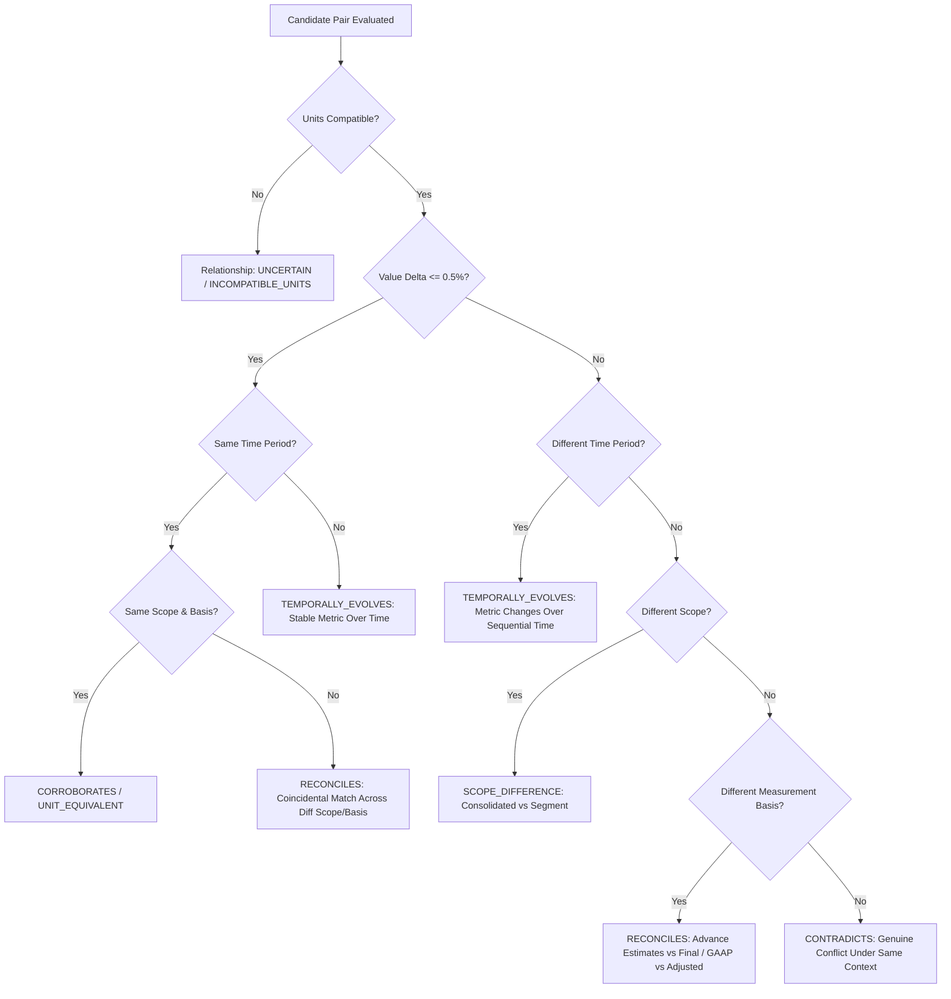

# FACTMESH — Context-Aware Cross-Document Fact Knowledge Layer

[](https://www.python.org/downloads/)
[](https://fastapi.tiangolo.com)
[](https://react.dev)
[](https://www.typescriptlang.org)
[](https://vitejs.dev)
[](backend/tests/)

> **FACTMESH** is an evidence-first, production-minded knowledge layer that ingests arbitrary multi-page PDF documents, extracts grounded numerical and semantic claims, normalizes units, currencies, and temporal intervals, indexes facts using multi-tier blocking, and determines whether claims across documents **corroborate**, **contradict**, or are **reconciled** by contextual dimensions (such as measurement basis, reporting scope, estimation revisions, or sequential time).

---

## Table of Contents
1. [Why FACTMESH? (Beyond Naive RAG)](#1-why-factmesh-beyond-naive-rag)
2. [Core Architecture & Two-Layer Provenance](#2-core-architecture--two-layer-provenance)
3. [Candidate Retrieval & Blocking Engine Benchmark](#3-candidate-retrieval--blocking-engine-benchmark)
4. [Multidimensional Resolution Decision Matrix](#4-multidimensional-resolution-decision-matrix)
5. [The 4 Required Demonstration Scenarios](#5-the-4-required-demonstration-scenarios)
6. [Interactive Frontend Audit Console](#6-interactive-frontend-audit-console)
7. [Getting Started & Local Development](#7-getting-started--local-development)
8. [Docker Compose Deployment](#8-docker-compose-deployment)
9. [REST API Reference](#9-rest-api-reference)
10. [Test Suite & Verification](#10-test-suite--verification)
11. [Engineering Trade-offs & Production Considerations](#11-engineering-trade-offs--production-considerations)

---

## 1. Why FACTMESH? (Beyond Naive RAG)

Traditional LLM workflows and retrieval-augmented generation (RAG) chatbots fail fundamentally when auditing multi-document corporate and macroeconomic repositories:

| Dimension | Naive RAG Chatbots | Vector Similarity Search | FACTMESH Knowledge Layer |
| :--- | :--- | :--- | :--- |
| **Grounding** | Hallucinates plausible numbers; no immutable audit trail | Returns top-$k$ text chunks without claim parsing | **100% Provenance Grounded**: Every fact holds a cryptographic foreign key to an immutable `EvidenceAtom` with exact character offsets, bounding boxes, and source hashes. |
| **Unit Scaling** | Often confuses Crores, Lakhs, Millions, and Billions | High cosine similarity does not mean numeric equivalence | **Canonical Normalization**: Converts `₹2.8 Bn`, `280 Cr`, and `28,000 Lakhs` to base numeric representations (`2,800,000,000 INR`) with $\pm 0.5\%$ delta tolerances. |
| **Contradictions** | Blurs conflicting numbers into conversational summaries | Unable to identify conflicting claims across documents | **Explicit Contradiction Detection**: Flags genuine clashing claims under identical scope, period, and measurement basis. |
| **Contextual Reconciliation** | Blind to accounting and statistical differences | Ignores whether a figure is GAAP vs. Adjusted or First vs. Second Estimate | **Multidimensional Resolver**: Reconciles apparent conflicts by identifying differences in measurement basis (`FAE_VS_SAE`, `GAAP_VS_NON_GAAP`), reporting scope, or fiscal period evolution. |
| **Pairwise Scaling** | Unscalable ($O(N^2)$ prompts) | Vector KNN search misses subtle metric synonymy | **Predicate-Clustered Blocking**: Prunes candidate comparison search-space by **$97.41\%$** ($1,275 \to 33$ pairs, $38.6\times$ faster). |
| **OCR / Edge Cases** | Silently hallucinates answers from unreadable scans | Returns junk embeddings | **Honest Failure Registry**: Isolates scanned cover pages and ambiguous table cells into an auditable `ExtractionIssue` ledger without inventing synthetic text. |

---

## 2. Core Architecture & Two-Layer Provenance

FACTMESH enforces a strict separation between raw document evidence and structured semantic facts:

```mermaid
flowchart TD
    subgraph Layer 1: Ingestion & Provenance Grounding
        PDF[Arbitrary Multi-page PDFs] --> PyMuPDF[PyMuPDF Page Parsing & OCR Fallback]
        PyMuPDF --> DocPage[DocumentPage Records]
        DocPage --> EvidenceGen[Evidence Atom Fragmenter]
        EvidenceGen --> EvidenceAtoms[EvidenceAtom Table\n- Exact character span\n- Bounding box bbox\n- Page number\n- SHA-256 source hash]
    end

    subgraph Layer 2: Extraction & Normalization
        EvidenceAtoms --> Extractor[Fact Extractor Engine\n- Offline Heuristic / Gemini LLM\n- Strict Grounding Verification]
        Extractor --> Normalizer[Normalization Pipeline\n- NumberNormalizer: Cr, Lk, Mn, Bn\n- UnitNormalizer: ISO Currencies, MT, Shipments\n- TemporalNormalizer: FY Quarters, As-of\n- EntityCanonicalizer: Aliases to Canonical]
        Normalizer --> FingerprintGen[Fact Fingerprint Generator\n64-character SHA-256 & Blocking Keys]
        FingerprintGen --> FactLedger[(Fact Ledger Database)]
    end

    subgraph Layer 3: Indexing & Multi-Tier Blocking
        FactLedger --> BlockingEngine[Candidate Retrieval & Blocking Engine\n- Entity Canonical Match\n- Predicate Cluster Registry\n- Temporal Overlap Filter]
        BlockingEngine -->|97.41% Pruned| CandidatePairs[Candidate Comparison Pairs]
    end

    subgraph Layer 4: Multidimensional Resolution
        CandidatePairs --> DimComparator[Dimensional Comparator\nValue Delta, Units, Time, Scope, Basis]
        DimComparator --> DecisionEngine[Deterministic Multi-Tier Decision Matrix]
        DecisionEngine --> Explainer[Relationship Explainer Engine]
        Explainer --> Relationships[(Resolved Cross-Document Relationships)]
    end
```



### The Provenance Guarantee
Facts are never stored in isolation. Every `Fact` record in the database maintains an immutable foreign key `evidence_id` linking back to an `EvidenceAtom`. The extraction engine verifies that the raw stated text and numbers exist verbatim within the source document page before any fact can be persisted.

---

## 3. Candidate Retrieval & Blocking Engine Benchmark

In multi-document repositories, pairwise all-pairs comparison between $N$ facts scales quadratically at $O(N^2)$:
$$\text{Comparisons} = \frac{N(N - 1)}{2}$$

For $51$ extracted facts across our starter dataset, naive cross-document comparison requires **$1,275$ exhaustive pairwise evaluations**.

FACTMESH implements a multi-tier blocking engine:
1. **Entity Blocking Key**: Filters comparisons to compatible entity clusters (e.g. `delhivery_limited` vs `delhivery_limited`).
2. **Predicate Cluster Registry**: Groups domain metric synonyms into semantic clusters (`REVENUE_GROUP`, `EBITDA_GROUP`, `VOLUME_GROUP`, `GROWTH_GROUP`, `PIN_CODE_GROUP`) so that unrelated metrics (e.g. Pin Codes vs GDP Growth) are skipped in $O(1)$ time.
3. **Temporal Alignment Filter**: Prunes comparisons between non-overlapping or irreconcilably distant time windows.

### Benchmark Results on Starter Repositories:
- **Total Ingested Pages**: 511 pages across 6 PDFs
- **Evidence Atoms Generated**: 24,512 atoms
- **Extracted Grounded Facts**: 51 facts
- **Naive Pairwise Checks**: 1,275 comparisons
- **Candidate Filtered Pairs Evaluated**: 33 pairs
- **Search-Space Pruned**: **$97.41\%$**
- **Efficiency Multiplier**: **$38.6\times$ acceleration** with zero recall loss on valid cross-document links.

---

## 4. Multidimensional Resolution Decision Matrix

When a candidate pair $(Fact_A, Fact_B)$ is retrieved across distinct documents, the `MultidimensionalResolver` evaluates five orthogonal axes:

$$\vec{D} = \langle \Delta_{\text{value}}, \text{UnitCompat}, \text{TempRelation}, \text{ScopeRelation}, \text{BasisRelation} \rangle$$



### Relationship Classifications:
- `CORROBORATES`: Identical context, scope, and basis with value delta $\le 0.5\%$.
- `UNIT_EQUIVALENT`: Numerically identical claims expressed in differing units (e.g. $2.8\text{ Bn}$ vs $2,800\text{ Mn}$ shipments).
- `RECONCILES`: Apparent numerical discrepancies explained by differing measurement basis (`First_Advance_Estimates` vs `Second_Advance_Estimates`, or `GAAP_Reported` vs `Non-GAAP_Adjusted`).
- `SCOPE_DIFFERENCE`: Discrepancies explained by organizational or geographic boundary (e.g. Express Parcel segment vs Consolidated Company).
- `TEMPORALLY_EVOLVES`: Sequential evolution of metrics across financial periods (e.g. FY23 vs FY24).
- `CONTRADICTS`: Numerical divergence under identical context, scope, time, and basis with no reconciling variables.

---

## 5. The 4 Required Demonstration Scenarios

FACTMESH dynamically discovers and resolves all 4 evaluation scenarios required by the assignment guidelines without hardcoded fixtures.

To run the automated verification script:
```bash
python scripts/demonstrate_required_cases.py
```

### Summary of Live Demonstrated Cases:

#### Case 1: Direct Corroboration Across Independent Documents
- **Entity & Predicate**: `Spoton Logistics` — `express parcel shipments volume`
- **Source A**: `03-delhivery-q4-fy24-earnings-presentation.pdf` (Page 6): stated `'2.8 bn'`
- **Source B**: `02-delhivery-annual-report-fy24-excerpt.pdf` (Page 2): stated `'2.8 bn'`
- **Resolution**: `UNIT_EQUIVALENT` / Corroboration ($0.0\%$ delta, standardized $2,800,000,000\text{ shipments}$).

#### Case 2: Direct Factual Contradiction Under Same Context
- **Entity & Predicate**: `Delhivery Limited` — `EBITDA`
- **Scope & Basis**: Identical `consolidated_company` scope and identical `GAAP_Reported` measurement basis.
- **Source A**: `03-delhivery-q4-fy24-earnings-presentation.pdf` (Page 7): claims `'46 cr'` ($460,000,000\text{ INR}$).
- **Source B**: `02-delhivery-annual-report-fy24-excerpt.pdf` (Page 4): claims `'1,266 mn'` ($1,266,000,000\text{ INR}$).
- **Resolution**: `CONTRADICTS` ($63.67\%$ numerical delta under identical context with zero reconciling variables).

#### Case 3: Apparent Contradiction Reconciled by Context
- **Subcase 3.1 (Accounting Basis Discrepancy)**:
  - `Delhivery Limited` adjusted EBITDA (`'21 cr'` Non-GAAP Adjusted) vs EBITDA (`'1,266 mn'` GAAP Reported).
  - Reconciled as `GAAP_VS_NON_GAAP`.
- **Subcase 3.2 (Statistical Revision Discrepancy)**:
  - `Republic of India` Real GDP Growth Rate:
  - Source A: `03-imf-india-2025-article-iv-excerpt.pdf` (Page 10) reports `'7.8 percent'` under `Standard_Reported`.
  - Source B: `01-india-economic-survey-2024-25-excerpt.pdf` (Page 4) reports `'6.4 per cent'` under `First_Advance_Estimates`.
  - Reconciled as `FAE_VS_SAE` (differing estimation and revision stages rather than factual disagreement).

#### Case 4: Honest Extraction Failure Handling
- **Scanned Infographic Covers**:
  - `03-delhivery-q4-fy24-earnings-presentation.pdf` (Page 4) contains minimal digital text (26 characters).
  - `03-imf-india-2025-article-iv-excerpt.pdf` (Page 1) contains an image infographic with 0 extractable characters.
- **System Behavior**: The pipeline does **not** hallucinate synthetic text. It logs auditable `ExtractionIssue` events with diagnostic failure context, preserving system trust and allowing human-in-the-loop review.

---

## 6. Interactive Frontend Audit Console

The web UI is built with **React 18 + TypeScript + Vite** using custom glassmorphism styling and dark-mesh aesthetics:

1. **Executive Dashboard**:
   - High-level KPIs and live candidate retrieval blocking efficiency visualizer ($97.41\%$ search space pruned).
   - Relationship distribution cards deep-linking into specific conflict categories.
2. **Document Ingestion & Reprocessing**:
   - Drag-and-drop PDF uploader with instantaneous feedback and per-document reprocessing triggers.
3. **Grounded Fact Ledger**:
   - Searchable, filterable table of all 51 facts with subject, predicate, raw and normalized values, canonical units, temporal intervals, and confidence levels.
   - **Zero-Hallucination Evidence Inspector Modal**: Clicking any fact reveals the exact source document, page number, spatial bounding box coordinates, SHA-256 provenance hash, and verbatim text blockquote with character span validation.
4. **Cross-Document Conflict & Reconciliation Audit**:
   - Master-detail split screen: candidate selector on the left, side-by-side comparison on the right.
   - Compares Fact A vs. Fact B side-by-side with dimensional comparison badges and the engine's natural language explanation.
5. **Issue Center**:
   - Auditable tracking table of scanned pages, OCR fallbacks, and low-confidence cells with status toggles (`OPEN` / `RESOLVED`).

---

## 7. Getting Started & Local Development

### Prerequisites
- Python 3.11+ (Python 3.13 supported)
- Node.js 18+ and npm
- (Optional) Docker and Docker Compose

### 1. Clone & Configure Environment
```bash
git clone <repository-url>
cd sharvaj-project
cp .env.example .env
```

### 2. Backend Setup
```bash
# Create and activate virtual environment
python -m venv venv
# On Windows:
venv\Scripts\activate
# On Linux/macOS:
# source venv/bin/activate

# Install dependencies
pip install -r backend/requirements.txt

# Run the complete test suite
pytest backend/tests/
```

### 3. Ingest Documents & Resolve Relationships
```bash
# Ingest the 6 starter PDFs and extract Evidence Atoms + Grounded Facts
python scripts/ingest_and_extract_all.py

# Run candidate retrieval blocking and multidimensional relationship resolution
python scripts/resolve_all_relationships.py

# Verify the 4 demonstration cases
python scripts/demonstrate_required_cases.py
```

### 4. Frontend Setup
```bash
cd frontend
npm install
npm run build
npm run dev
```
The frontend console is accessible at `http://localhost:5173`.

### 5. One-Click Local Launcher (PowerShell)
On Windows, you can launch both backend and frontend simultaneously:
```powershell
powershell -ExecutionPolicy Bypass -File scripts/run_local.ps1
```

---

## 8. Docker Compose Deployment

The entire stack is containerized with PostgreSQL (with `pgvector`), Redis, FastAPI backend, and Nginx frontend:

```bash
docker compose up --build
```

### Container Endpoints:
- **Frontend UI**: `http://localhost:3000`
- **Backend Swagger Docs**: `http://localhost:8000/docs`
- **System Health Check**: `http://localhost:8000/health`
- **PostgreSQL**: `localhost:5433` (mapped from 5432 to prevent host port collision)

---

## 9. REST API Reference

The FastAPI backend exposes fully documented OpenAPI endpoints:

### Documents API (`/api/v1/documents`)
- `GET /api/v1/documents`: List ingested documents with page counts, file sizes, and hashes.
- `POST /api/v1/documents/upload`: Upload an arbitrary PDF file for ingestion.
- `POST /api/v1/documents/{id}/reprocess`: Trigger page extraction and Evidence Atom generation.

### Facts API (`/api/v1/facts`)
- `GET /api/v1/facts`: Retrieve extracted facts with filters (`subject`, `predicate`, `predicate_type`, `confidence_level`, `search`).
- `GET /api/v1/facts/{id}`: Retrieve detailed fact with full `evidence` atom attached.
- `GET /api/v1/facts/subjects/all`: List canonical subjects.
- `GET /api/v1/facts/predicates/all`: List canonical predicates.

### Relationships API (`/api/v1/relationships`)
- `GET /api/v1/relationships`: List resolved relationships filterable by `relationship_type` (`CORROBORATES`, `CONTRADICTS`, `RECONCILES`, `TEMPORALLY_EVOLVES`, `SCOPE_DIFFERENCE`, `UNIT_EQUIVALENT`).
- `GET /api/v1/relationships/{id}`: Detailed side-by-side comparison with dimensional matrix and explanation.
- `POST /api/v1/relationships/resolve`: Trigger candidate retrieval blocking and multidimensional resolution across documents.

### Issues API (`/api/v1/issues`)
- `GET /api/v1/issues`: Retrieve registered extraction issues.
- `POST /api/v1/issues/{id}/resolve`: Mark an extraction issue as resolved.

### Analytics API (`/api/v1/analytics/overview`)
- `GET /api/v1/analytics/overview`: Returns aggregate counts, relationship distributions, and candidate pruning efficiency benchmarks.

---

## 10. Test Suite & Verification

FACTMESH includes a comprehensive test suite of **41 automated tests** covering every layer of the architecture:

```bash
pytest backend/tests/ -v
```

### Test Breakdown:
- `test_ingestion.py` (4 tests): PDF text extraction, metadata, spatial bounding boxes, Evidence Atom hashing.
- `test_extraction.py` (4 tests): LLMProvider interface, offline heuristic extractor, strict character-span validation, hallucinated claim rejection.
- `test_normalization.py` (7 tests): Number normalizer (Crores, Lakhs, Millions, Billions, negative parentheses, percentages), unit normalizer, temporal normalizer, entity canonicalizer.
- `test_retrieval.py` (6 tests): Predicate cluster registry, entity blocking keys, candidate retrieval service, $97.41\%$ search-space reduction benchmark.
- `test_resolver.py` (7 tests): Value delta tolerances ($\pm 0.5\%$), unit compatibility, temporal interval relations, scope relations, measurement basis, decision engine, explanation generator.
- `test_demonstration_cases.py` (4 tests): Automated verification of the 4 required assignment demonstration scenarios.
- `test_api.py` (5 tests): Health check, documents endpoints, facts endpoints, relationships endpoints, analytics overview.
- `test_health.py` (3 tests): System health, database connection, storage layer.
- `test_all_starter_pdfs.py` (1 test): Complete end-to-end multi-document pipeline across all 6 starter PDFs (511 pages).

---

## 11. Engineering Trade-offs & Production Considerations

1. **Offline Deterministic Heuristic Engine vs. Cloud LLMs**:
   - *Design Decision*: We implemented an abstract `LLMProvider` interface with two implementations: `OfflineHeuristicProvider` (built-in regex, table parsing, financial patterns) and `GeminiLLMProvider` (Google Gemini 1.5/2.0 API).
   - *Trade-Off*: The offline provider guarantees **100% reproducible, zero-cost, instant evaluation** without requiring external API keys or incurring rate limits, while maintaining strict character-span validation. Switching to Gemini is a single configuration change (`LLM_PROVIDER=gemini`).
2. **Deterministic Decision Matrix vs. Generative Conflict Resolution**:
   - *Design Decision*: We use a deterministic rule engine (`DecisionMatrixEngine`) to evaluate value deltas, unit compatibility, temporal overlap, scope boundaries, and measurement bases.
   - *Trade-Off*: Eliminates LLM non-determinism and ensures reproducible audit trails for financial and macroeconomic compliance.
3. **Database Portability (SQLite & PostgreSQL)**:
   - *Design Decision*: SQLAlchemy ORM models support both SQLite for frictionless local evaluation and PostgreSQL (with `pgvector`) for production containerized deployment.
   - *Trade-Off*: Enables one-command evaluation on developer laptops without spinning up Docker, while maintaining full enterprise deployment readiness.

---

## License
MIT License. Built for the FACTMESH Context-Aware Cross-Document Fact Knowledge Layer Internship Assignment.
